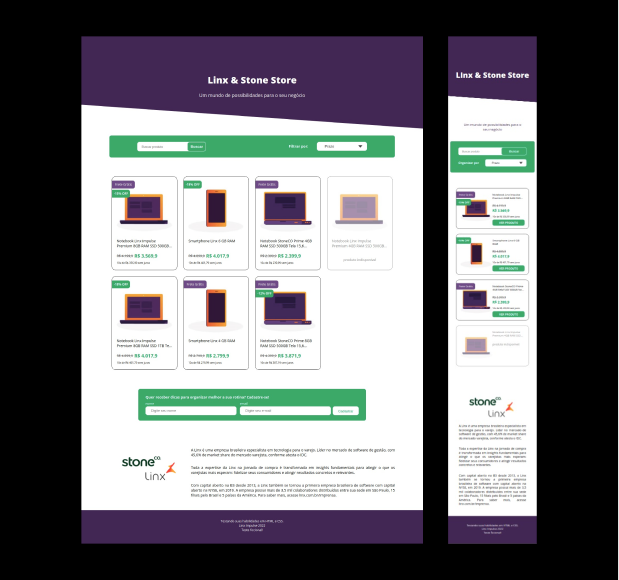

<h1>Test DSN Linx - 2.0</h1>

## ABOUT

#### This project was developed for practice and avaliaty new candidates for position in the team as Web Designer Jr or interns.

#### it has practical challenges, and some concepts used frequently so that those looking for a place in the sun can be properly evaluated
---

## STACK TECHNOLOGIES

### Developed with the following technologies

- [HTML5](https://developer.mozilla.org/en-US/docs/Web/Guide/HTML/HTML5)
- [CSS3](https://developer.mozilla.org/en-US/docs/Web/CSS)
- [Javascript](https://developer.mozilla.org/en-US/docs/Web/JavaScript)

---

## RUNNING

### Just click on link below.

<a href="https://www.youtube.com/watch?v=qtN0EphRDCw">https://test-dsn-linx.vercel.app/</a>

just kidding =]

### Also can clone project for local run:

~ git clone https://github.com/arthur94a/test-dsn-linx-2.0.git

  

### for run project:

install Node.js

npm install

run in terminal into project repo:

npm run serve

  

open in browser on localhost:3000

### for use SASS your need:

npm run scss

---

Created by Arthur Araujo.

